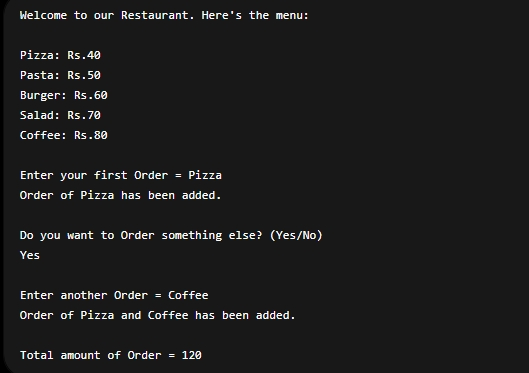

# 🍽️ Resturant Management System 

A simple command-line-based Restaurant Management System built using Python.  
This project allows users to view a menu, place orders, and calculate the total bill.

## 📌 Features

- Display restaurant menu with prices
- Take customer orders
- Allow multiple item ordering
- Calculate total bill automatically
- Simple and beginner-friendly Python code

## 🧾 Menu Items

| Item   | Price (Rs) |
|--------|------------|
| Pizza  | 40         |
| Pasta  | 50         |
| Burger | 60         |
| Salad  | 70         |
| Coffee | 80         |

## ⚙️ How It Works

1. Program shows the menu to the user.
2. User enters their first order.
3. System checks if item exists in menu:
   - If yes → adds price to total bill
   - If no → shows error message
4. User is asked if they want to order more items.
5. If yes → second order is taken and added to bill.
6. Final total bill is displayed.

## Output Screenshot
   
